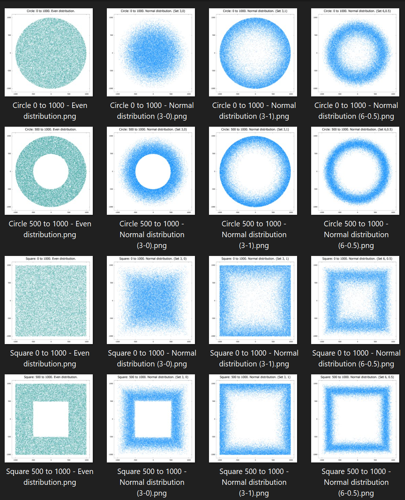

  
_A Spigot/Paper Plugin | Native Minecraft Version: 1.16_
# Jake's Random Teleporter `[J-RTP]`

What does it do? • Teleports a player to a random location by when they type `/rtp` or `/wild`, or when they join the
server for the first time • Tons of configuration from basic shape and size to multiple configs and distribution
patterns

For the main download, go to [the page on Spigot](https://www.spigotmc.org/resources/jakes-rtp.80201/),
or for statistics about the plugin, go to [the bStats page](https://bstats.org/plugin/bukkit/JakesRTP/9843).

## A brief list of what you can configure.

* The world you get teleported to (don't forget, multiple configs for multiple worlds)
* Can players use /rtp with these settings, or it can only be used by the server or admins  
* The priority of the settings relative to other settings
* What shape that the points will appear in...
    * Square
    * Circle
    * Rectangle
* A gap in the shape where people will not be teleported (done as radius min for circle and square)
* Where the random teleport is centered...
    * At the world's spawn
    * At the players current location
    * At a specific x and z
* Will the locations be chosen such that they are evenly distributed or with a Gaussian distribution...
* If Gaussian distribution is enabled, these settings can be used:
    * Shrink - Inversely related to the standard deviation of the distribution (larger values make it denser)
    * Center - A number from 0 to 1 where 0 centers the points at the min distance, 0.5 is between min and max, and 1 is
      at max
* A list of commands that get executed after the player is teleported 
* The number of seconds a player must wait between calling the /rtp command and getting teleported
* The number of seconds a player must wait before using the /rtp command again
* Do new players get teleported randomly when they join for the first time? *
* Do new players get teleported randomly when they die? *
* The cost of the teleport (if economy is enabled)  
* The highest and lowest y-value that a player can get teleported to
* Some stuff about how many spots to check for safety, though these shouldn't need to be modified for a normal world.

###### _* Denotes static settings. (Settings that are not per config and generally are only applicable to one config at a time)_

###### _All of this is per individual config. Multiple configs can exist at the same time_

Oh, and if you want more than one config, you just copy and paste the config file, change the name, and suddenly you
have 2! Or even better, make a new blank file, add the lines `load-from: [other-settings-file-name]` and then you have
a duplicate of the other settings file which you can add lines to modify! In [this video](https://www.youtube.com/watch?v=hg4JQ8PN40I)
I explain how the config works, and how to do multiple configs.

## The configs (and all their documentation)

* The [main config](JakesRTP-Core/src/main/resources/config.yml)
* Some info on [profiles/rtpProfile and distributions](doc/profiles.md)
* The default [rtpProfile](JakesRTP-Core/src/main/resources/rtpProfile/default-settings.yml) config
* Two different default distribution profiles
    * [one](JakesRTP-Core/src/main/resources/distributions/default-symmetric.yml) for circles and squares
    * [another](JakesRTP-Core/src/main/resources/distributions/default-rectangle.yml) for rectangles

## Commands overview

`/rtp` and `/wild` both make the user randomly teleport  
`/forcertp <playerName>` will randomly teleport the given player (assuming you have permission)  
`/forcertp <playerName> [-c <rtpConfigName> | -w <destinedWorld>]` (extra
settings)  
`/rtp-admin reload` will reload the config from the file(assuming you have permission)

Go [here](doc/commands.md) for a more detailed explination.

## Permissions

* jakesrtp.use
    * description: Allows the use of the base "/rtp" command
    * default: true
* jakesrtp.usebyname:
    * description: Allows players to give a rtpProfile name after rtp as such: "/rtp \<settingsName>"
    * default: false
* jakesrtp.rtpondeath
    * description: If rtp-on-death is enabled, players with this node will be respawn in a random location
    * default: false
* jakesrtp.noCooldown
    * description: Allows the user to ignore the cool-down timer
    * default: op
* jakesrtp.nowarmup
    * description: Allows the user to ignore the warm-up timer
    * default: op
* jakesrtp.others
    * description: Allows the use of "/rtp" on other players
    * default: op
* jakesrtp.admin
    * description: Allows the usage of the "/rtp-admin" command.
    * default: op

Go to the [plugin.yml](src/main/resources/plugin.yml) to all registered permissions and permission packs.

## Random points examples

The random coordinate generator I made for this plugin does a real good job at evenly distributing points over an area,
assuming you _want_ them to be distributed evenly. You can choose from having the points evenly distributed throughout
the given area, or have a Gaussian distribution where the points are more densely distributed around a specific radius.
Here are some examples of possible distributions, though it is worth noting that every value can be changed, and these
are far from the only options. The examples displayed are just to give an idea of what the settings can do.

#### Here are some settings that I like.

Both of these have a relatively consistent distribution towards the middle and inside (while still leaving a gap for
spawn), but they also make it so that player will _not_ frequently be placed near the max distance. While the
distribution of rtp locations is not something people tent to focus much on, it may still be fun to get that one off rtp
that takes you further out that most others do.

| Using a circle...       | Using a square...       |
| ----------------------- | ----------------------- |
| .png "icon") | .png "icon") |

###### All images made with points generated by the plugin, and plotted with gnuPlot.
